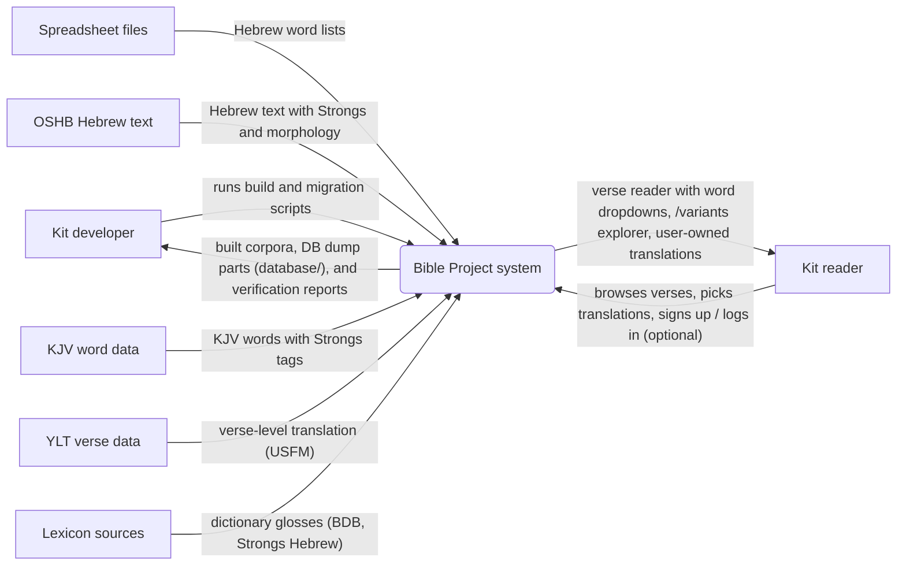
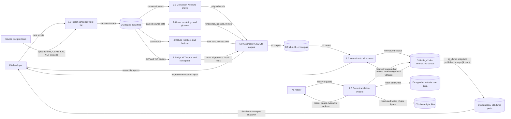

Living document — update these diagrams when adding features.

# bible-project — Architecture

**Relationship to Bible:** this repo is the current, live Bible Project. `cosbykit-afk/Bible` is an earlier partial copy of the same project — its own repo description says so ("Earlier partial Bible-database copy; current work continues in the bible-project repository"). Do not treat them as two independent systems: bible-project is the continuation with the U-8 maqqef-component repair, the U-9 verse-remap repair, YLT word alignment, the Flask translation website, and the v2 normalization, none of which exist in the older Bible repo.

**v2 status (2026-09-28):** the corpus has been normalized to the v2 schema (`schema_v2.sql`, design rationale in `schema_v2.md`). `bible_v2.db` is built and verified, and the live website now serves it via `app_v2.py` — **live cutover DONE 2026-09-28 ~17:15 PDT** on Kit's authorization ("go live with it both on github and on the laptop"; schema approved by Kit: "the schema looks great"). The diagrams below describe v2, which is now the production schema.

**2026-10-06 changes (this revision):** the website gained a login system — new `user_accounts` table (real logins: `/signup`, `/login`, `/logout`; werkzeug salted password hashes; session cookies), `translation.owner_id` FK to `user_accounts` (NULL = legacy/anonymous; `translation.user_id` keeps its legacy `app_user` meaning), and a new `lemma_default` table (sticky/propagating lemma choices with translation-source integers 1=KJV | 2=Young's | 3=user-defined). `/variants` now serves only academic/textual variants (Kit 2026-10-01, implemented commit `f323dfca`). `website/schema_custom.sql` is a DESIGN-ONLY proposal (`custom_translations`), not applied — recorded in grounding notes, not drawn in the ERD.

**2026-09-30 changes (previous revision):** `word_variants` merged into one table tagged by `variant_kind` (`'spelling'` | `'textual'`, CHECK-enforced — Kit's decision); new `word_notes` table (one-to-many word notes, Kit 2026-09-29); `/variants` explorer route added to `app_v2.py`; `database/` now carries a 4-part pg_dump of the live `bible_v2.db`; the 129 OSHB anomaly resolutions applied to `bible_v2`. The level-1 DFD below was also corrected: the previous revision still showed the website reading the v1 `bible.db` live, which the 9/28 cutover superseded — the live site reads `bible_v2.db` via `app_v2.py`.

## 1. Context diagram (level 0)



## 2. Level-1 data flow diagram



Process grounding: 1.0 `ingest_canonical.py`; 4.0 `build_roots*.py` + `build_lexicon.py`; 5.0 `build_ylt_align.py`, `repair_u8_maqqef_kjv.py`, `repair_u8_lexicon.py`, `repair_u9_verse_remap_kjv.py`, `repair_u9_lexicon.py`; 6.0 `assemble_bible.py`; 7.0 `migrate_v2.py`, then the derived-data stage `build_alignment.py`, `build_variants.py`, `apply_morph_corrections.py`, the post-normalization fixes `apply_anomaly_resolutions.py` (129 OSHB-verified fixes, 2026-09-29) and `migrate_variants_merge.py` (word_variants variant_kind merge, 2026-09-30); 8.0 `website/app_v2.py` — the LIVE server since the 2026-09-28 ~17:15 PDT cutover (supervisord `bible`, port 5057, `BIBLE_DB=/opt/bible/bible_v2.db`, Apache `/bible`→5057). `website/app.py` (the v1 server) is retained in the repo but superseded; the pre-cutover `/bible-v2` staging copy on port 5058 was observed 2026-09-28 — its post-cutover role was not re-verified. Routes: book/chapter/verse/word/choice/translations/reading/export, `/variants` (added 2026-09-30, commit 3635422d; academic/textual-only since commit f323dfca, 2026-10-06), `/signup`, `/login`, `/logout` (added 2026-10-06 — optional login, never required for browsing), `/interlinear`, JSON `/api/books|chapters|verses`, static `/papyrus-tile.png`. Auth: werkzeug salted password hashes, Flask session cookies; `current_user()` returns the `user_accounts` row (inactive users treated as logged out). `/choice` (POST) propagates the chosen rendering into `lemma_default` via `record_lemma_default`. Startup creates `user_accounts`/`lemma_default` IF NOT EXISTS and ALTERs legacy rows (`owner_id`, `source`, `other_option_id`).

## 3. Entity–relationship diagram (v2 schema)

```mermaid
erDiagram
    BOOKS {
        int book_id PK
        string name_en
        string name_he
    }
    VERSES {
        int verse_id PK
        int book_id FK
        int chapter
        int verse
    }
    WORDS {
        int word_id PK
        string orig_word_id
        int verse_id FK
        int word_pos
        string pointed
        string unpointed
        string letters
        string strongs FK
        int strongs_source_id FK
        int morph_pattern_id FK
        int is_aramaic
        int root_id FK
        int root_form_seq FK
        int root_vowel_seq FK
    }
    STRONGS {
        string strongs PK
        string language
    }
    STRONGS_COMPONENTS {
        string strongs FK
        int seq
        string component
    }
    STRONGS_SOURCES {
        int source_id PK
        string source
    }
    MORPH_PATTERNS {
        int pattern_id PK
        string pattern
        string language
        string parse_status
        string parse_notes
    }
    MORPH_SEGMENTS {
        int segment_id PK
        int pattern_id FK
        int seq
        string code
        string pos
        string stem
        string person
        string gender
        string number
        string state
    }
    ROOT_ENTRY {
        int root_id PK
        string root
        int word_count
    }
    ROOT_FORM {
        int root_id FK
        int form_seq
        string prefix1
        string suffix1
        int word_count
        string example_pointed
    }
    ROOT_VOWEL {
        int root_id FK
        int root_form_seq FK
        int vowel_seq
        string vowel_pattern
        int word_count
    }
    LEXICON {
        int root_id FK
        int root_form_seq FK
        int vowel_seq FK
    }
    LEXICON_KJV_RENDERING {
        int root_id FK
        int root_form_seq FK
        int vowel_seq FK
        int seq
        string rendering
    }
    LEXICON_YLT_RENDERING {
        int root_id FK
        int root_form_seq FK
        int vowel_seq FK
        int seq
        string rendering
    }
    LEXICON_YLT_CONTEXT {
        int root_id FK
        int root_form_seq FK
        int vowel_seq FK
        int seq
        int verse_id FK
        string context_text
    }
    LEXICON_FOUND_VERSE {
        int root_id FK
        int root_form_seq FK
        int vowel_seq FK
        int verse_id FK
    }
    GLOSSES {
        string strongs FK
        string source
        string gloss
    }
    KJV_WORDS {
        int kjv_word_id PK
        int verse_id FK
        int kjv_pos
        string kjv_word
        string strongs FK
    }
    KJV_RENDERINGS {
        int rendering_id PK
        int word_id FK
        string kjv_word
        string kjv_strongs FK
        string method
    }
    YLT_VERSES {
        int verse_id PK_FK
        string text
    }
    YLT_RENDERINGS {
        int rendering_id PK
        int word_id FK
        string ylt_word
        int ylt_word_pos
        string label
    }
    WORD_ALIGNMENT {
        int alignment_id PK
        int verse_id FK
        int seq
        int hebrew_word_id FK
        int kjv_word_id FK
        int ylt_rendering_id FK
        string syntactic_role
        string role_basis
    }
    WORD_VARIANTS {
        int word_id FK
        int variant_seq
        string variant_kind
        string unpointed
        string letters
        string variant_text
        string convention
        string source
        string witness
        string variant_type
        string basis
        string created_at
    }
    WORD_NOTES {
        int note_id PK
        int word_id FK
        string note_text
        string note_type
        string source
        string created_at
    }
    MORPH_VARIANTS {
        int word_id FK
        int variant_seq
        string morph_code
        int pattern_id FK
        string confidence
        string source
        string basis
    }
    APP_USER {
        int user_id PK
        string name
        string created_at
    }
    TRANSLATION {
        int translation_id PK
        int user_id FK
        int owner_id FK
        string name
        string description
        string created_at
        string updated_at
    }
    OTHER_OPTION {
        int option_id PK
        int translation_id FK
        int idx
        string text
        string created_at
    }
    USER_ACCOUNTS {
        int user_id PK
        string username
        string password_hash
        string email
        string display_name
        int is_active
        string created_at
        string last_login_at
    }
    LEMMA_DEFAULT {
        int translation_id FK
        string lemma
        string rendering
        int from_word_id
        int source
        int other_option_id FK
    }
    CHOICES_FILE {
        string path PK
        int size_bytes
    }
    BOOKS ||--o{ VERSES : contains
    VERSES ||--o{ WORDS : contains
    VERSES ||--o{ KJV_WORDS : contains
    VERSES ||--|| YLT_VERSES : has_text
    VERSES ||--o{ WORD_ALIGNMENT : aligns
    WORDS }o--|o STRONGS : tagged_with
    WORDS }o--|o STRONGS_SOURCES : source_recorded_in
    WORDS }o--|o MORPH_PATTERNS : parsed_as
    STRONGS ||--o{ STRONGS_COMPONENTS : decomposes_to
    STRONGS ||--o{ GLOSSES : glossed_by
    MORPH_PATTERNS ||--o{ MORPH_SEGMENTS : splits_into
    ROOT_ENTRY ||--o{ ROOT_FORM : has
    ROOT_FORM ||--o{ ROOT_VOWEL : has
    ROOT_VOWEL ||--|| LEXICON : describes
    WORDS }o--|| ROOT_VOWEL : numbered_as
    LEXICON ||--o{ LEXICON_KJV_RENDERING : lists
    LEXICON ||--o{ LEXICON_YLT_RENDERING : lists
    LEXICON ||--o{ LEXICON_YLT_CONTEXT : cites
    LEXICON ||--o{ LEXICON_FOUND_VERSE : found_in
    LEXICON_YLT_CONTEXT }o--|| VERSES : quotes
    LEXICON_FOUND_VERSE }o--|| VERSES : locates
    KJV_WORDS }o--|o STRONGS : tagged_with
    WORDS ||--o{ KJV_RENDERINGS : rendered_as
    KJV_RENDERINGS }o--|o STRONGS : via_kjv_strongs
    WORDS ||--o{ YLT_RENDERINGS : rendered_as
    WORD_ALIGNMENT }o--|o WORDS : hebrew_side
    WORD_ALIGNMENT }o--|o KJV_WORDS : kjv_side
    WORD_ALIGNMENT }o--|o YLT_RENDERINGS : ylt_side
    WORDS ||--o{ WORD_VARIANTS : varies_as
    WORDS ||--o{ WORD_NOTES : noted_in
    WORDS ||--o{ MORPH_VARIANTS : morph_readings
    MORPH_VARIANTS }o--|o MORPH_PATTERNS : staged_as
    APP_USER ||--o{ TRANSLATION : owns
    USER_ACCOUNTS ||--o{ TRANSLATION : owns_as
    TRANSLATION ||--o{ OTHER_OPTION : adds
    TRANSLATION ||--o{ LEMMA_DEFAULT : has_defaults
    LEMMA_DEFAULT }o--|o OTHER_OPTION : links_when_custom
    TRANSLATION ||--|| CHOICES_FILE : stores_choices_in
    TRANSLATION }o--o{ WORDS : targets
```

Notes on the ERD: composite primary keys (`ROOT_FORM`, `ROOT_VOWEL`, `LEXICON` and its children, `GLOSSES`, `WORD_VARIANTS`, `MORPH_VARIANTS`, `STRONGS_COMPONENTS`, `LEMMA_DEFAULT` on (translation_id, lemma)) are declared in `schema_v2.sql` / `website/schema.sql`; the `PK`/`FK` marks above show membership, not single-column keys. `YLT_VERSES.verse_id` is both PK and FK to `VERSES`. The `TRANSLATION }o--o{ WORDS : targets` link is logical, not a declared FK — corpus (`bible_v2.db`) and website data (`app.db`) are separate SQLite files by design; choice files index by `word_id` at byte offset `word_id - 1`. `translation.owner_id` is nullable (ON DELETE SET NULL; NULL = legacy/anonymous) while `translation.user_id` keeps its legacy `app_user` meaning; `lemma_default.other_option_id` is populated only when source=3 (user-defined). The design-only `custom_translations` proposal (`website/schema_custom.sql`) is deliberately not drawn — it is not applied.

## Grounding notes

- OBSERVED (`schema_v2.sql`, 24 tables): exact table/column names, PKs, FKs, UNIQUE and CHECK constraints quoted above; `words.strongs` nullable (6,008 words), `words.morph_pattern_id` nullable (79 words), `words.strongs_source_id` null iff strongs null (CHECK).
- OBSERVED (migration verification, 2026-09-28): `migrate_v2.py` completed in 66.9 s over 264,217 words; `v_words` 0 differing rows; 0 FK violations; lexicon round-trips 0 mismatches on 126,869 rows; `orig_word_id` not unique (51399, 252785, 227963 each map to 2 rows — split/merged tokens), so no UNIQUE constraint.
- OBSERVED: 1,865 composite Strong's values decomposed into 3,783 `strongs_components` rows (reconstruction assertion 1,865/1,865); 155 components (e.g. `H010`) have no row of their own, so components are NOT a hard FK to `strongs`.
- OBSERVED: `verses` = UNION of (book,chapter,verse) from words, ylt_verses, kjv_words — the 139 English-versification orphans (e.g. Genesis 31:55) resolve; 209 word-derived verses lack YLT.
- OBSERVED: 7,552 `morph_patterns`; `parse_status` parsed/unparsed per the OSHB Hebrew Morphology Codes document (openscriptures.github.io/morphhb/parsing/HebrewMorphologyCodes.html, fetched 2026-09-28, CC BY 4.0); `morph_variants` holds 28 staged readings over 12 words (confidence legacy/established/probable/secondary), never assigned to `words` until adjudicated.
- OBSERVED (`schema_v2.sql` diff, 2026-09-30): `word_variants` MERGED per Kit's decision — ONE table tagged by `variant_kind` CHECK (`'spelling'` | `'textual'`), gaining `variant_text`, `witness`, `variant_type`, `created_at`; `convention`/`source` now nullable (used only for spelling rows). Column discipline per `variants_method.md`: spelling rows use `unpointed`/`letters` + `convention` (`v1-medial` | `academic-final`) + `source` (`v1-stored` | `oshb-verbatim` | `transduced-from-v1` | `conjectural`); textual rows use `variant_text` (pointed reading) + `witness` (manuscript siglum: `LXX`, `DSS`, `SP`, …) + `variant_type` (`orthographic` | `substantive` | …). `variant_seq` continues per word across kinds (spelling rows first, textual appended).
- OBSERVED (`migrate_variants_merge.py`, 2026-09-30): upgraded existing databases in place — all 528,565 rows backfilled `'spelling'`, old-column values verified byte-identical via EXCEPT both ways, 0 FK violations. No textual rows populated yet; the textual apparatus is populated separately.
- OBSERVED (`schema_var_notes.sql`, 2026-09-29): defines the `word_notes` table (note_id PK, word_id FK, note_text, note_type, source, created_at) — one word, many notes, per Kit ("definitely a one to many relationship"); resolves U-4. The file's earlier standalone `word_variants` definition is marked superseded (kept as the column-origin record for the textual kind); the merged table in `schema_v2.sql` is authoritative.
- OBSERVED (`apply_anomaly_resolutions.py`, 2026-09-29): applies 129 OSHB-verified unpointed/letters fixes to `bible_v2`.
- OBSERVED (`website/app_v2.py` diff, commit 3635422d, 2026-09-30): new `/variants` explorer route serving variant readings; routes are now book/chapter/verse/word/choice/translations/reading/export plus `/variants`.
- OBSERVED (`database/bible_dump.sql.gz.part-aa`…`.part-ad`, merged 2026-09-30): pg_dump of the live `bible_v2.db`, 4 parts, published in the repo as a distributable corpus snapshot (commit 02032780).
- OBSERVED (`website/schema.sql`): `app_user`, `translation`, `other_option` verbatim; `website/app.py` (Flask) opens `bible.db` read-only, `app.db` read-write, `user_data/translation_<id>.choices` byte files.
- OBSERVED: **live cutover DONE 2026-09-28 ~17:15 PDT** on Kit's authorization ("go live with it both on github and on the laptop"): supervisord `bible` runs `app_v2.py` on 5057 with `BIBLE_DB=/opt/bible/bible_v2.db`; Apache `/bible`→5057 unchanged; `/bible` + direct 5057 verified 200; word/book/verse pages 200. The 2026-09-30 laptop re-ship (anomaly-corrected `bible_v2.db`) was verified live. The previous diagram revision still showed the website reading the v1 `bible.db` live — that contradiction is corrected in this revision (8.0 reads D3 only; D2 remains the migration input).
- OBSERVED (`website/schema.sql` diff, commit 7b7b03e8, 2026-10-06): the website login system — new `user_accounts` table (user_id PK autoincrement, username UNIQUE, password_hash, email, display_name, is_active, created_at, last_login_at); `translation.owner_id` INTEGER REFERENCES `user_accounts(user_id)` ON DELETE SET NULL (NULL = legacy/anonymous translation). `app_v2.py` implements `/signup` (rejects passwords under 4 chars; werkzeug `generate_password_hash`), `/login` (`check_password_hash`, `last_login_at` bump), `/logout`; login state in Flask session cookies that survive restarts; browsing and translation creation work while logged out (`owner_id` then NULL). `app_user`/`translation.user_id` keep their legacy anonymous-session meaning by design.
- OBSERVED (same commit; `app_v2.py` `record_lemma_default`): new `lemma_default` table — composite PK (translation_id, lemma): a non-default word choice propagates as that lemma's default rendering from that word_id forward (lemma = Strong's, else `root:<root_code>`); rendering TEXT stored (drop-downs are built per inflection, not per lemma); `source` 1=KJV | 2=Young's | 3=user-defined (NULL on legacy/backfilled rows); `other_option_id` FK to `other_option` populated only for source=3; an explicit per-word choice always wins; resetting one word to default does NOT clear the lemma default. Startup creates the tables IF NOT EXISTS and ALTERs legacy rows (lines 102–120).
- OBSERVED (`website/schema_custom.sql`, added commit 7b7b03e8, 2026-10-06): DESIGN ONLY — do not apply without Kit's approval. Proposes `custom_translations` (PK (user_id, word_id): variant_seq, translation_source CHECK ('kjv'|'ylt'|'computed'|'custom'), source_index, custom_text required for 'custom') as the atomic per-(user, word) choice backing store for the word-UI wireframe (`website/wireframe-word-ui.html`); user_id FK → user_accounts ON DELETE CASCADE; cross-database word_id to the corpus left unenforced by design. Same commit also added `variant-investigation.md`, `website/papyrus-tile.png` (served at `/papyrus-tile.png`), and `website/wireframe-word-ui.html`.
- OBSERVED (commit f323dfca, 2026-10-06 — the 2026-10-03 revision's PENDING item, now implemented): `/variants` serves only academic/textual variants per Kit's 2026-10-01 direction — v1 manuscript-variance rows (`v1-medial` convention) are excluded; medial/final-only duplicates are folded with an on-page note; while no textual rows are loaded the page states it is empty.
- OBSERVED: v1 row counts from README — words 264,217; kjv_words 610,324; kjv_renderings 631,950; ylt_renderings 337,601; ylt_verses 23,145; glosses 17,347; books 39; root_entry 30,087; root_form 57,724; root_vowel 126,869; lexicon 126,869.
- OBSERVED: `worker-out/` subdirectories (canon, kjv, lexicons, oshb, ylt) — the basis for D1; repair scripts named in 5.0; U-8 maqqef-component and U-9 verse-remap repairs with before/after coverage figures in README.
- INFERRED: the numbered process boundaries 1.0–8.0 group scripts by their documented purpose; the repo documents each script's role but no explicit pipeline wiring, so boundaries are inferred.
- INFERRED: `KJV_RENDERINGS.method` values 'direct' | 'maqqef-component' | 'verse-remap' and `YLT_RENDERINGS.label` = 'bridged' are observed in schema comments as the design's vocabulary.
